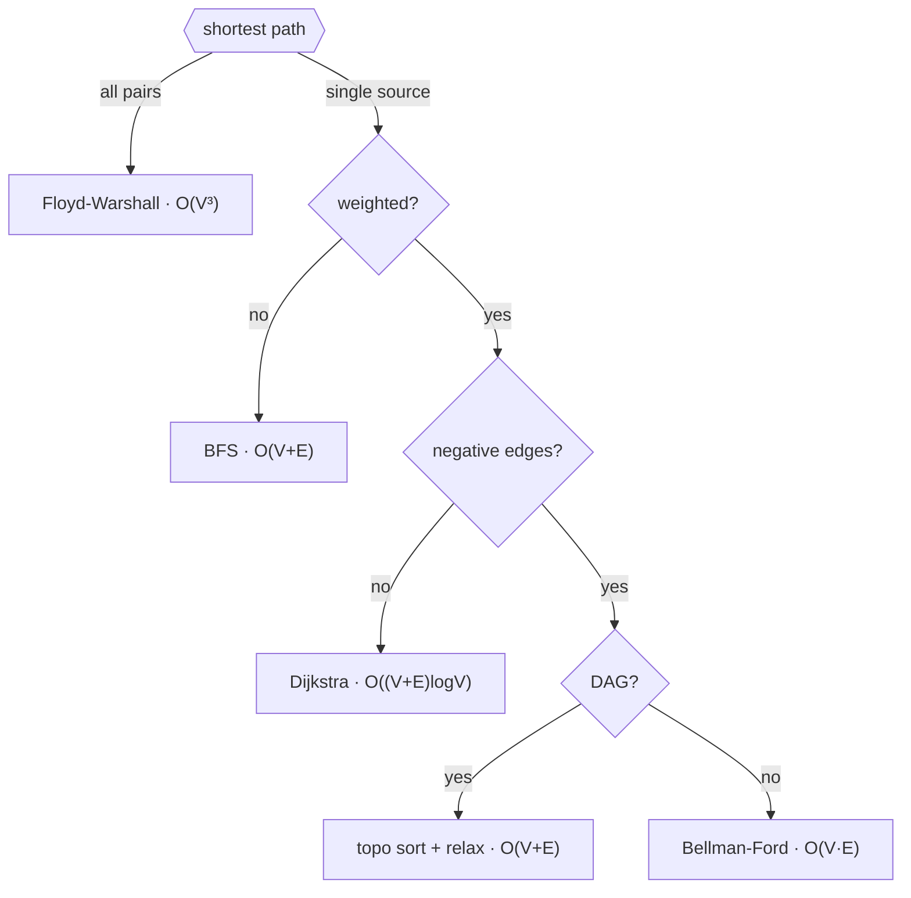

# DS Algo

Quick revision of Data Structures & Algorithms — self-contained C++ files, each with a runnable `main()` example.

Compile and run any file directly, e.g.:

```sh
g++ -std=c++17 "Sorting Algorithms/1_selection_sort.cpp" -o out && ./out
```

TC = Time Complexity, SC = Space Complexity (both already commented in the code, mirrored here for quick lookup). `n` = input size unless noted otherwise.

## 🔍 Searching Algorithms

| Algorithm | TC | SC |
|---|---|---|
| [Linear Search](Searching%20Algorithms/1_linear_search.cpp) | O(n) worst/avg, O(1) best | O(1) |
| [Binary Search](Searching%20Algorithms/2_binary_search.cpp) | O(log n) | O(1) |

## 📊 Sorting Algorithms

| Algorithm | TC | SC |
|---|---|---|
| [Selection Sort](Sorting%20Algorithms/1_selection_sort.cpp) | O(n²) always | O(1) |
| [Bubble Sort](Sorting%20Algorithms/2_bubble_sort.cpp) | O(n²) always (no early-exit flag) | O(1) iterative, O(n) recursive (stack) |
| [Insertion Sort](Sorting%20Algorithms/3_insertion_sort.cpp) | O(n²) worst/avg, O(n) best | O(1) iterative, O(n) recursive (stack) |
| [Merge Sort](Sorting%20Algorithms/4_merge_sort.cpp) | O(n log n) always | O(n) |
| [Quick Sort](Sorting%20Algorithms/5_quick_sort.cpp) | O(n log n) avg, O(n²) worst (sorted input) | O(log n) avg, O(n) worst (stack) |

## 🔗 Linked List

| Operation | TC | SC |
|---|---|---|
| [Insert at end](Linked%20List/1_linked_list.cpp) | O(n) | O(1) |
| [Insert at head](Linked%20List/1_linked_list.cpp) | O(1) | O(1) |
| [Display](Linked%20List/1_linked_list.cpp) | O(n) | O(1) |

## 📥 Stack

| Implementation | Push | Pop/Peek/Empty | SC |
|---|---|---|---|
| [Using Array](Stack/1_stack_using_array.cpp) | O(1) | O(1) | O(n) fixed-size array |
| [Using Linked List](Stack/2_stack_using_linkedlist.cpp) | O(1) | O(1) | O(n) |
| [Using Queue](Stack/3_stack_using_queue.cpp) | O(n) (rotates through helper queue) | O(1) | O(n) |

## 📤 Queue

| Implementation | Enqueue/Push | Dequeue/Peek/Empty | SC |
|---|---|---|---|
| [Using Array](Queue/1_queue_using_array.cpp) | O(1) | O(1) | O(n) fixed-size array |
| [Using Linked List](Queue/2_queue_using_linkedlist.cpp) | O(1) | O(1) | O(n) |
| [Using Stack](Queue/3_queue_using_stack.cpp) | O(n) (moves through helper stack) | O(1) | O(n) |

## 🌳 Binary Tree

| Topic | TC | SC |
|---|---|---|
| [Implementation](Binary%20Tree/1_bin_tree.cpp) | — | — |
| [Traversal, recursive (pre/in/post)](Binary%20Tree/2_bin_tree_traversal.cpp) | O(n) | O(h) recursion stack |
| [Traversal, iterative (pre/in/post)](Binary%20Tree/3_bin_tree_traversal_iterative.cpp) | O(n) | O(h), O(n) for postorder (two stacks) |
| [Build from Preorder & Inorder](Binary%20Tree/4_bin_tree_using_preorder_inorder.cpp) | O(n²) worst (linear search per node) | O(n) |
| [Build from Postorder & Inorder](Binary%20Tree/5_bin_tree_using_postorder_inorder.cpp) | O(n²) worst (linear search per node) | O(n) |
| [Level Order Traversal](Binary%20Tree/6_bin_tree_level_order_traversal.cpp) | O(n) | O(w) — w = max width, O(n) worst |
| [Height](Binary%20Tree/7_bin_tree_height_diameter.cpp) | O(n) | O(h) |
| [Diameter (naive)](Binary%20Tree/7_bin_tree_height_diameter.cpp) | O(n²) (recomputes height per node) | O(h) |
| [Segment Tree — build](Binary%20Tree/8_segment_tree.cpp) | O(n) | O(n) tree + O(log n) stack |
| [Segment Tree — point update / query](Binary%20Tree/8_segment_tree.cpp) | O(log n) | O(log n) |
| [Segment Tree — range update (lazy propagation)](Binary%20Tree/8_segment_tree.cpp) | O(log n) | O(log n) |

## 🌲 Binary Search Tree

| Topic | TC | SC |
|---|---|---|
| [BST — insert / search / delete](Binary%20Search%20Tree/1_bst.cpp) | O(h) = O(log n) avg, O(n) worst (skewed) | O(h) |
| [AVL Tree — insert / search / delete](Binary%20Search%20Tree/2_avl_tree.cpp) | O(log n) guaranteed (self-balancing) | O(log n) |

## ⛰️ Heap

| Operation | TC | SC |
|---|---|---|
| [Insert](Heap/1_max_heap.cpp) | O(log n) | O(1) |
| [Delete](Heap/1_max_heap.cpp) | O(log n) | O(1) |
| [Build Heap](Heap/1_max_heap.cpp) | O(n) (not O(n log n) — amortized) | O(log n) |
| [Heap Sort](Heap/1_max_heap.cpp) | O(n log n) | O(log n) |

Same complexities apply to [Min Heap](Heap/2_min_heap.cpp).

## 🕸️ Graph Theory

`V` = vertices, `E` = edges.

| Topic | TC | SC |
|---|---|---|
| [BFS](Graph%20Theory/1_graph.cpp#L8) | O(V + E) | O(V) |
| [DFS](Graph%20Theory/1_graph.cpp#L45) | O(V + E) | O(V) |
| [Cycle Detection, Undirected (BFS & DFS)](Graph%20Theory/2_cycle_detection.cpp) | O(V + E) | O(V) |
| [Cycle Detection, Directed (DFS & BFS/Kahn's)](Graph%20Theory/3_cycle_detection_directed.cpp) | O(V + E) | O(V) |
| [Topological Sort, DFS](Graph%20Theory/4_topo_sort.cpp) | O(V + E) | O(V) |
| [Topological Sort, BFS (Kahn's)](Graph%20Theory/5_kahns_algo.cpp) | O(V + E) | O(V) |
| [Dijkstra (PQ & Set)](Graph%20Theory/6_dijkstra.cpp) | O((V + E) log V) | O(V + E) |
| [Prim's MST](Graph%20Theory/7_mst_prims_algo.cpp) | O(E log V) | O(V + E) |
| [Disjoint Set — find / union](Graph%20Theory/8_disjoint_set.cpp) | O(α(n)) amortized ≈ O(1) | O(1) (excl. recursion) |
| [Bellman-Ford](Graph%20Theory/9_bellman_ford.cpp) | O(V · E) | O(V) |
| [Floyd-Warshall](Graph%20Theory/10_floyd_warshall.cpp) | O(V³) | O(1) extra |
| [Bipartite Check (BFS & DFS)](Graph%20Theory/11_bipartite_check.cpp) | O(V + E) | O(V) |

### 🧭 Graph algorithm cheatsheet

**Shortest path:**



**Everything else:**

| Need | Use |
|---|---|
| Traverse / components | [BFS or DFS](Graph%20Theory/1_graph.cpp) |
| MST | [Prim's](Graph%20Theory/7_mst_prims_algo.cpp) (dense) / Kruskal's via [Disjoint Set](Graph%20Theory/8_disjoint_set.cpp) (sparse) |
| Task ordering | [Topo sort (DFS)](Graph%20Theory/4_topo_sort.cpp) / [Kahn's (BFS)](Graph%20Theory/5_kahns_algo.cpp) — DAG only |
| Cycle check, undirected | [DFS/BFS + parent check](Graph%20Theory/2_cycle_detection.cpp) |
| Cycle check, directed | [DFS + recursion-stack](Graph%20Theory/3_cycle_detection_directed.cpp#L26) or Kahn's |
| 2-coloring / conflict split | [Bipartite check](Graph%20Theory/11_bipartite_check.cpp) — fails iff odd cycle exists |
| Many "are X,Y connected?" queries | [Disjoint Set](Graph%20Theory/8_disjoint_set.cpp) — ~O(1)/op |

**Gotchas:** Dijkstra breaks with negative edges (greedy "settle once" assumption). Bellman-Ford also detects negative cycles. A DAG never has a negative cycle, so topo-sort-and-relax is safe and faster than either.

## 🔤 Trie

| Operation | TC | SC |
|---|---|---|
| [Insert](Trie/1_trie_implementation.cpp) | O(L), L = word length | O(L) worst (new nodes) |
| [Search / StartsWith](Trie/1_trie_implementation.cpp) | O(L) | O(1) |

## 🔁 Prefix / Infix / Postfix Conversion

| Conversion | TC | SC |
|---|---|---|
| [Infix to Postfix](Prefix%20Infix%20Postfix%20Conversion/1_infix_to_postfix.cpp) | O(n) | O(n) |
| [Infix to Prefix](Prefix%20Infix%20Postfix%20Conversion/2_infix_to_prefix.cpp) | O(n) | O(n) |
| [Postfix to Infix](Prefix%20Infix%20Postfix%20Conversion/3_postfix_to_infix.cpp) | O(n²) worst (repeated string concatenation) | O(n) |
